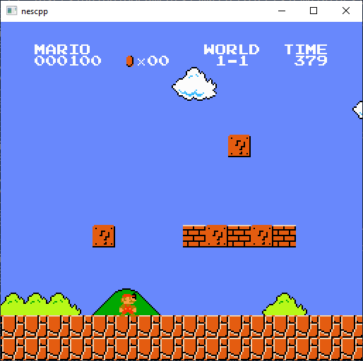
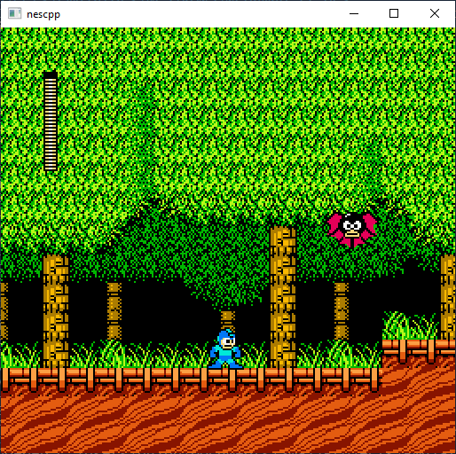
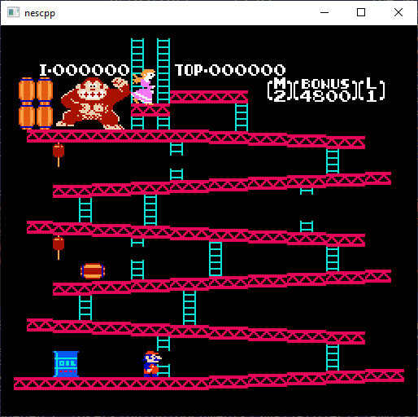

# NESCPP
NES emulator written in C++ using SFML for input, graphics and sound.
## Features
* Instruction-accurate CPU
* Cycle-accurate PPU
* Mostly working sound
* Supported mappers:
  * Mapper 0
  * Mapper 1
  * Mapper 2
## Building
Currently only building on Windows.
- Install Visual Studio Community 2019.
- Build `NESCPP.sln`
## Usage
Run it with the game ROM as the only command line argument.  
e.g. `NESCPP.exe mario.nes`
## Screenshots

## To Do
* DMC audio channel
* Fix audio stutter
* Fix noise channel
* NES 2.0 format support
